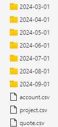
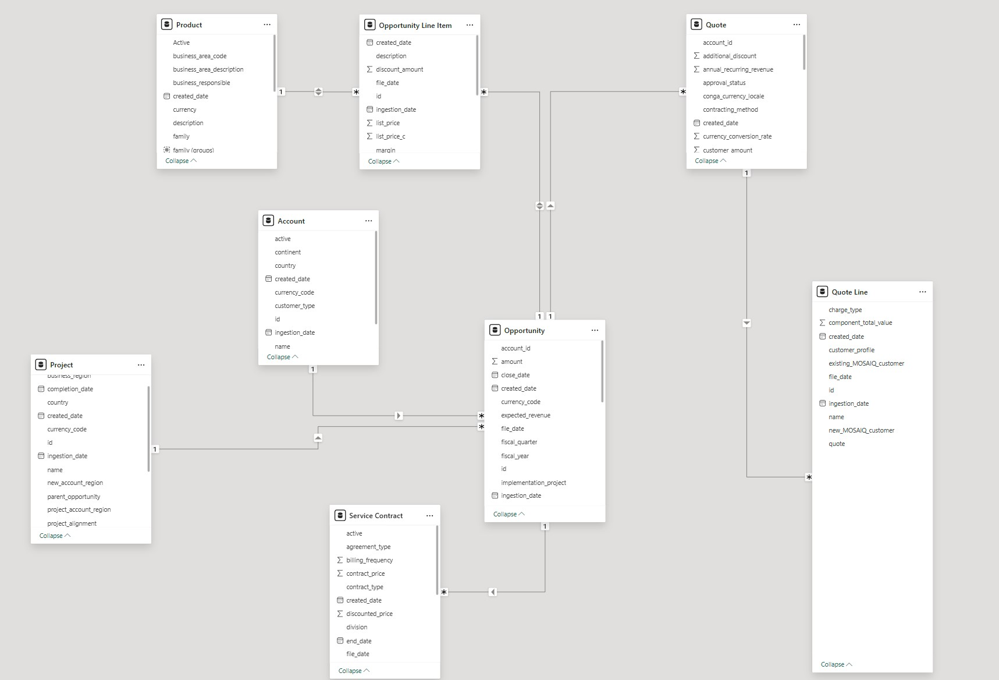

  

    <h1 align="center">Azure Databricks Data Engineer (End-to-end ETL Business Intelligence Pipeline) </h1>

		<em>Developed with the tools and platforms below.</em>

	
	
	

##  Table of contents

> - [Overview](#overview)
> - [Tools & Technologies](#key-features)
> - [Data Source](#data-source)
> - [Project Structure](#project-structure)
> - [Analytics](#analytics)
> - [Getting Started](#project-progression)
> - [Note](#note)

## Overview

(Spoiler alert! Check out the interactive dashboard, which is the final output of this End-2-End Data Pipeline. Link to the [dashboard](https://app.powerbi.com/view?r=eyJrIjoiNzk2MTdiZmUtYWY1Mi00ZDY2LTlhNTgtM2QxZWIyZmM2MGU1IiwidCI6IjgwZTRjYzhlLTA0Y2MtNDM2ZC1hZDIxLThhMDhhMTkwOWJmZSIsImMiOjJ9))

This repository showcases a comprehensive Business Intelligence project built on Azure Databricks, designed to deliver scalable data insights pipeline. The project focuses on transforming raw data into refined, analytics-ready datasets, enabling organizations to generate actionable insights through reporting and visualization. Leveraging Azure services like Databricks, Data Factory, and Data Lake Storage, the solution ensures efficient data flow and management. The end goal is to load the processed data into a Business Intelligence tool (such as Power BI or Tableau), empowering users to create real-time reports, dashboards, and data visualizations that drive informed business decisions. The project supports both full-load (complete data refresh) and incremental-load (merging new data with existing datasets) processes, making it ideal for dynamic and evolving business environments.

## Tools & Technologies

- `Azure Databricks`: Utilized as a Data Lakehouse solution to perform ETL processes and distributed data transformations, combining the flexibility of data lakes with the structure of a data warehouse. Azure Databricks enables scalable and efficient data processing and advanced analytics.
- `Azure Data Lake Storage (ADLS)`: Serves as the primary storage layer, handling raw, intermediate, and final datasets. It integrates seamlessly with Azure Databricks to provide scalable and secure data storage.
- `Azure Data Factory`: Orchestrates and controls the entire ETL pipeline, automating the ingestion, transformation, and loading of data across different processing layers. It ensures seamless data movement and scheduling, connecting different services within the pipeline.
-`PowerBI`: Acts as the front-end visualization tool, where processed data is loaded and transformed into meaningful insights. Power BI enables users to build interactive dashboards and reports, providing real-time data analytics that support informed business decision-making.

## Data Sources

The data in this project is generated anonymously using Mockaroo, a powerful online tool for creating realistic and anonymous datasets. The dataset mimics CRM data typically found in Salesforce environments, including objects such as Opportunity, Account, Opportunity Line Item, Project, Quote, Quote Line, Product, and Service Contract. 

Each object represents critical elements of a business's sales and project lifecycle. Business use case can be found [here](./appendix/BusinessUseCaseAndDictionary.pdf).

For efficient data processing, the project uses a combination of full load and incremental load strategies. The full load is used for the initial data setup, ensuring all historical data is captured. Incremental loads handle ongoing data ingestion by only processing new or modified records, making the system more efficient over time. 

### Full-load Data Object: No partition 

1. `Account`: Stores information about the customers, businesses, or organizations associated with an opportunity, including their name, type, and location.
2. `Project`: Captures detailed information about projects related to accounts and opportunities, such as project status, region, and completion date.
3. `Quote`: Represents formal offers made to customers, containing pricing details, contract terms, and discount structures.

### Incremental-Load Data Object: Partition by date (end of month)

4. `Opportunity`: Represents potential sales or deals that a business is working to close, containing information such as close dates, revenue, and sales stages.
5. `Opportunity Line Item`: Represents the individual products or services included in a sales deal or opportunity.
6. `Quote Line`: Details the individual components of the quote, including product descriptions, prices, and customer-specific discounts.
7. `Product`: Refers to the goods or services that a business sells, including key information such as product codes, categories, and costs.
8. `Service Contract`t: Outlines the terms for services provided to customers, including pricing, contract duration, and renewal details.

### Data Sample

### Data Model 

## Analytics

In this project, I will connect **Power BI** to my Azure Databricks cluster to visualize insights derived from the pipeline. By utilizing Power BI, I can create interactive reports and dashboards, enabling stakeholders to explore key metrics such as customer profitability, product sales, project creation trends, and cumulative revenue growth.

This project is designed to provide the BI team with a robust foundation for analyzing and presenting data, enhancing their ability to drive strategic decisions and improve business outcomes.

For more information on how to connect **Power BI** to Azure Databricks, please refer to the [Microsoft documentation](https://learn.microsoft.com/en-us/azure/databricks/partners/bi/power-bi) for detailed instructions.

Link to the [dashboard](https://app.powerbi.com/view?r=eyJrIjoiNzk2MTdiZmUtYWY1Mi00ZDY2LTlhNTgtM2QxZWIyZmM2MGU1IiwidCI6IjgwZTRjYzhlLTA0Y2MtNDM2ZC1hZDIxLThhMDhhMTkwOWJmZSIsImMiOjJ9) built by me and my team.

## Project Progression
1. Create Azure Data Lake Storage 
2. Create 3 containers including bronze - silver - gold
3. Use any data simulating generator to generate full-load and incremental-load object data based on sample and dictionary. Then import them into bronze container
4. Create a repo or folder in Databricks
5. Import the dbc file found in this [link](https://learn.microsoft.com/en-us/azure/databricks/partners/bi/power-bi) into that folder so you can help all of the files in the project structure.
6. Develop and test the data pipeline in Databricks, ensuring data transformation from bronze to silver to gold.
7. Build interactive dashboards in Power BI to provide insights on customer profitability, product sales, and revenue growth.
8. Implement full-load and incremental-load automate process to scale the data pipeline and ensure up-to-date insights.
